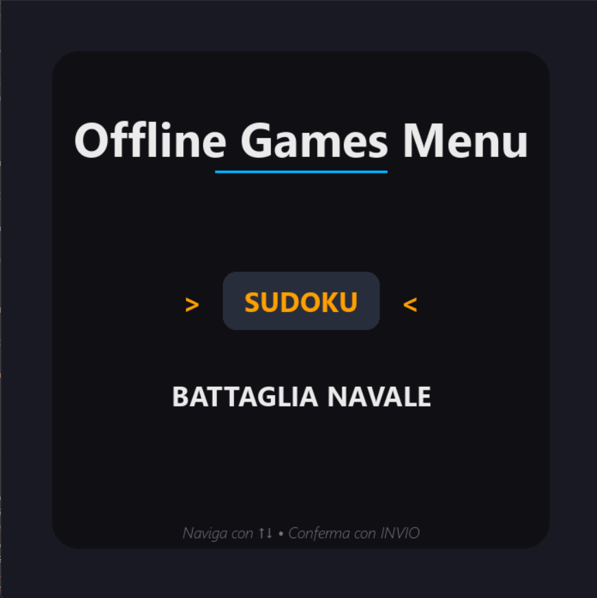
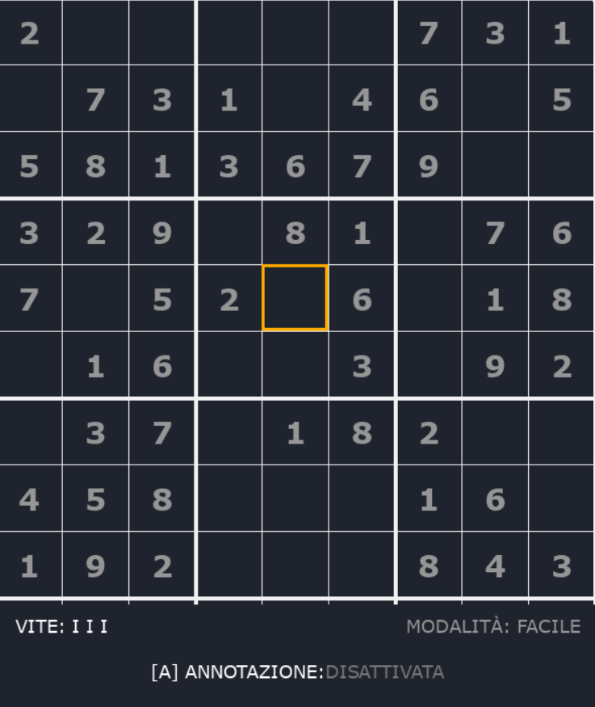
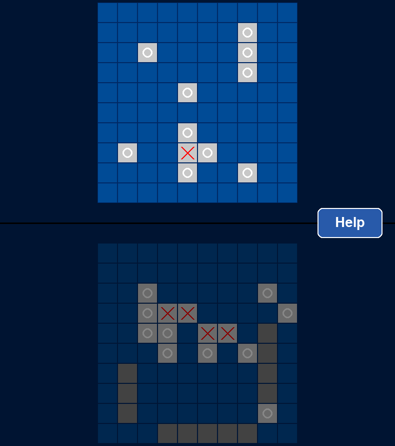

# Quality Development - Offline Games 🕹️
Questo repository è stato creato per fornire un template Python dedicato allo **sviluppo di giochi offline**, includendo <ins>pipeline di automazione e istruzioni</ins> per i test con pytest.

## How to start (one-time step)
Per **scaricare** il progetto e configurare il tuo ambiente locale, esegui questi comandi:

```Plaintext
git clone git@github.com:USERNAME/nome-repo.git
cd nome-repo
git pull origin main
```
**Setup del virtualenv**:
```Plaintext
python -m venv .venv
source .venv/bin/activate    # su Linux/macOS
.venv\Scripts\activate       # su Windows
pip install -r requirements.txt
```
## Pipeline & Repository Structure
Per far sì che le automazioni funzionino correttamente, abbiamo mantenuto la struttura del template originale. Le **pipeline** si occupano di **verificare la qualità del codice** ad ogni modifica.

**Directory Structure**: Assicurati di non spostare la cartella .github/.

**Workflow**: Le definizioni delle pipeline si trovano in:

```
.github/workflows
```
## How to make a commit
Quando lavori al tuo gioco, effettua dei <ins>commit frequenti e descrittivi</ins>. Usa i **Conventional Commits** come in questi esempi:

```
git add src/game_logic.py
git commit -m 'feat(sudoku): add grid generation logic'
```
Altri esempi di messaggi approvati:
```
fix(battleship): prevent ships from overlapping

docs(readme): update installation guide

test(logic): add unit tests for score calculation
```
## Software Testing & Coverage
La qualità è fondamentale. Usiamo **pytest** per assicurarci che tutto funzioni e per monitorare **quanto codice è coperto dai test**.

Per far girare i test e vedere il report:

```
pytest test_main_menu.py -v --cov=main_menu --cov-report=term-missing
pytest --cov=sudoku --cov-report=term-missing
pytest --cov=battleship --cov-report=term-missing
```
⚠️ Il progetto mantiene una code coverage minima del 75%.

# Il Progetto: Offline Games
## Main Menu


## Sudoku


## Battaglia Navale


Il software è una raccolta di **giochi classici** sviluppati puramente in **Python**, pensati per essere giocati **senza connessione internet**.

**Sudoku**: Una sfida logica con generazione dinamica delle griglie.

**Battaglia Navale**: Il classico gioco di strategia riprodotto in digitale.

Per offrire un'esperienza utente superiore e un'interfaccia grafica accattivante, il progetto utilizza:
```
Libreria Grafica di riferimento:  [pygame] 
```


